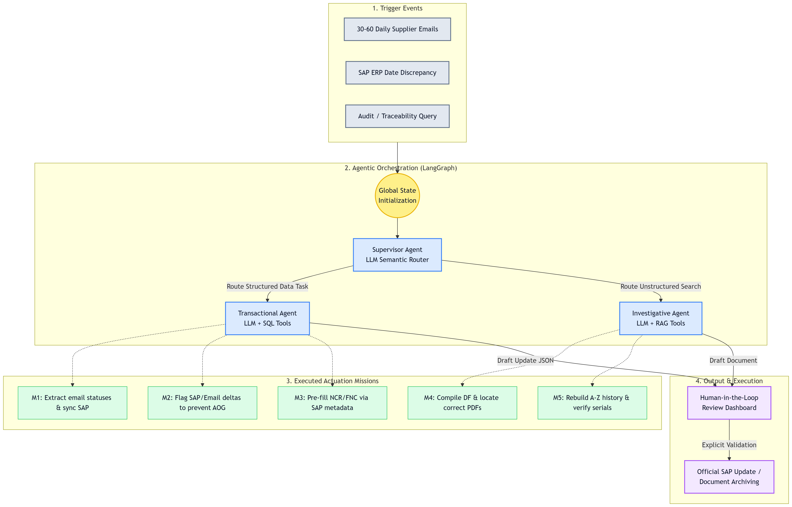

# ActuAI — Project Documentation

> **Aerospace Production Workflow Automation** — a secure, on-premise, multi-agent AI system
> that eliminates Non-Value-Added (NVA) administrative work in an EN9100-regulated
> Actuation service, with a Human-in-the-Loop (HITL) checkpoint before every real-world effect.

---

## Table of contents

1. [Why ActuAI exists](#1-why-actuai-exists)
2. [The five missions](#2-the-five-missions)
3. [System architecture](#3-system-architecture)
4. [The multi-agent pipeline](#4-the-multi-agent-pipeline)
5. [Data layer](#5-data-layer)
6. [LLM strategy — NVIDIA NIM](#6-llm-strategy--nvidia-nim)
7. [Security model](#7-security-model)
8. [The industrial simulation (mock data)](#8-the-industrial-simulation-mock-data)
9. [Frontend — the HITL dashboard](#9-frontend--the-hitl-dashboard)
10. [Deployment](#10-deployment)
11. [Configuration reference](#11-configuration-reference)
12. [Testing & verification](#12-testing--verification)
13. [Known limitations & roadmap](#13-known-limitations--roadmap)

---

## 1. Why ActuAI exists

The Actuation service is the operational backbone of thrust-reverser manufacturing for the
A350 program. Its daily reality is a constant translation exercise between **unstructured
communication** (supplier emails, quality reports, scattered PDFs on network drives) and a
**rigid ERP** (SAP). Engineers and buyers spend hours on double data entry, cross-checking
delivery dates against assembly schedules, re-typing non-conformance reports, hunting for
the right revision of a certificate, and reconstructing component histories for audits.

ActuAI automates that translation layer under two hard constraints:

- **Data sovereignty** — the system is designed to run on-premise (edge infrastructure).
  Documents are embedded locally (sentence-transformers, no external embedding API), and the
  only cloud dependency is the inference endpoint (NVIDIA NIM, OpenAI-compatible), which is
  swappable for a self-hosted NIM container without any code change.
- **EN9100 compliance** — an AI agent never writes to SAP or sends an email on its own.
  Every agent output is a *draft* that lands in a validation queue; only an explicit,
  role-checked human approval triggers the real-world effect, and every step is recorded in
  a tamper-evident, hash-chained audit log.


---

## 2. The five missions

Each mission maps to a concrete NVA task the service performs today by hand. All five are
**implemented end-to-end and verified against real NVIDIA NIM inference**.

### Mission 1 — Component Supply-Chain Monitoring

*"Stop re-typing supplier emails into SAP."*

| | |
|---|---|
| **Trigger** | A supplier email arrives via the webhook (`POST /api/ingest/email`) — e.g. *"la livraison de la commande PO-412958 est repoussée de 8 jours"*, a shipping confirmation, or a client asking for an ETA. |
| **Agents** | Supervisor → **Transactional** (supplier facts → SAP update draft) or **Responder** (client ETA enquiry → reply-email draft). |
| **What the agent does** | Extracts structured facts with the LLM (`request_type`, `po_number`, `new_status`, `delay_days`), confirms the PO exists in the datalake (SQL tool), computes the new expected date, and drafts either a `SAP_UPDATE` payload or an `EMAIL_REPLY`. |
| **On human approval** | The backend PUTs the new date to SAP (`/api/bapi/purchase-orders/{po}/update-date`), **upserts the ActuAI-owned `deliveries` record** (status, delay, timestamp — the durable trace that survives ETL re-syncs), refreshes the mirrored PO, or records the reply in the `sent_emails` outbox. |
| **Key files** | `actuai_backend/src/agents/transactional/agent.py`, `agents/responder/agent.py`, `api/routers/hitl.py` (approval side-effects), `etl/sap_connector.py` (`push_delivery_date`). |

### Mission 2 — Production Schedule Coordination (AOG risk)

*"Flag assembly-line blockages before they happen — not after."*

Two detection paths converge on the same deduplicated alert:

- **Reactive** — while drafting a delay update (Mission 1), the Transactional agent joins the
  new ETA against the Airbus `production_schedules` table. If the part now arrives *after*
  its assembly-line drop-dead date, a second, urgent `AOG_ALERT` task is raised immediately —
  it does not wait for the date change to be approved.
- **Proactive** — every ETL tick (default 60 s), right after the SAP mirror refresh,
  `etl/aog_scanner.py::scan_schedule_discrepancies` sweeps **all open POs** against the
  schedule. A discrepancy is flagged even if no email ever announced it.

Both paths call `create_aog_task`, which dedupes on `(po_number, supplier_eta)` so repeated
scans and repeated emails never produce duplicate alerts. Each alert carries a
`detected_by` tag (`delay_email` / `proactive_scan`) shown in the UI. Approving an AOG alert
sends an expedite-shipping escalation email to the supplier's logistics address and audits
the decision.

**Key files:** `etl/aog_scanner.py` (shared alert factory + proactive sweep),
`etl/scheduler.py` (hook into the poll loop, gated by `AOG_SCAN_ENABLED`),
`api/routers/hitl.py` (escalation email on approval).

### Mission 3 — Quality & Non-Conformance Management (FNC + 8D)

*"Pre-fill the NCR; track the corrective action to closure."*

- **Pre-fill** — a short request ("Créer FNC pour rayure sur carter de la commande
  PO-456123") routes to the Transactional agent, which pulls the part reference, supplier
  and PO metadata already on file, generates an NCR number (`FNC-YY-XXXXXX`) and drafts a
  complete Quality Notification. The controller only reviews and submits; approval POSTs it
  to SAP.
- **8D lifecycle** — every FNC then moves through a condensed, forward-only 8D state machine:

  ```
  PENDING ──▶ D3_CONTAINMENT ──▶ D5_CORRECTIVE_ACTION ──▶ D8_CLOSED
  ```

  Transitions are exposed via `POST /api/quality/fncs/{ncr}/advance` (RBAC: engineer,
  compliance officer or admin) and rendered in the dashboard's **Quality tab** as a 4-step
  stepper with an *Advance* button and status filter chips.

  **Design constraint that shaped the implementation:** the ETL re-mirrors
  `report_8d_status` from SAP on every sync tick. A locally-stored transition would be
  silently rolled back a minute later. Therefore every 8D write goes **to SAP first**
  (`PUT /api/bapi/quality-notifications/{ncr}/8d-status`), then updates the local mirror —
  SAP stays the single source of truth and the ETL stays idempotent. Skipping steps or
  reopening a closed report returns `409` (consistent with the append-only audit philosophy).

**Key files:** `agents/transactional/agent.py` (`_draft_quality_notification`),
`api/routers/quality.py` (list + advance endpoints, `EIGHT_D_SEQUENCE`),
`etl/sap_connector.py` (`push_8d_status`, `create_quality_notification`),
`actuai_mock_data/sap_api/main.py` (SAP-side 8D endpoint),
`actuai_frontend/src/components/QualityView.tsx`.

### Mission 4 — Technical Documentation Control (RAG with version control)

*"Find the right document — and the right revision of it."*

- The mock generators produce technical PDFs (`Certificat_Matiere`, `Rapport_8D`,
  `PV_Controle`) with an aerospace revision index in both the filename
  (`Certificat_Matiere_PO-471478_revD.pdf`) and the document body.
- `etl/document_indexer.py` loads each PDF individually, splits it into overlapping chunks
  (1000/200), embeds them **locally** with `all-MiniLM-L6-v2`, and stores them in Qdrant with
  version-control metadata per chunk: `source`, `revision` (regex-parsed from the filename),
  `doc_type`, `indexed_at`, `clearance`.
- The **Investigative agent** retrieves the top-k chunks (filtered by the caller's clearance
  — see [Security](#7-security-model)), grounds the big cloud model (Llama 3.1 70B) in those
  passages only, and returns an answer whose sources cite the revision explicitly:
  *"Certificat_Matiere_PO-471478_revD.pdf (rev D)"*.
- `GET /api/documents` aggregates the indexed corpus (one entry per document, with revision
  badge and indexing timestamp) — rendered in the dashboard's **Documents tab**.
- Approving a `RAG_ANSWER` task records the human sign-off in the audit trail (no SAP write).

Indexing runs on demand (`docker compose exec actuai-backend python -m etl.document_indexer`)
or automatically at boot with `INDEX_DOCS_ON_START=true` (daemon thread, non-blocking).

**Key files:** `etl/document_indexer.py`, `agents/investigative/agent.py` + `retriever.py`,
`api/routers/documents.py`, `actuai_mock_data/generators/documents.py`,
`actuai_frontend/src/components/DocumentsView.tsx`, `RagSynthesisView.tsx` (chat-style
co-pilot that can also run fresh live queries).

### Mission 5 — End-to-End Component Traceability

*"One serial number in, the component's complete life story out."*

A request like *"Fais-moi l'historique complet et l'audit du numéro de série SN-2460"*
triggers a **hybrid** run:

1. The serial is extracted (regex `SN-...`), then the **structured trail** is reconstructed
   by SQL joins across the datalake: `GoodsReceipt` (physical reception) → `PurchaseOrder`
   (order, supplier, part) → `QualityNotification` (any defects on record).
2. The **unstructured trail** is retrieved from Qdrant (certificates, reports mentioning the
   component).
3. The investigative model synthesizes a single audit narrative from both, emitted as a
   `TRACEABILITY_DOSSIER` task showing the SQL facts, the compiled narrative, and the source
   documents side by side.

The engineer's approval **is** the archival event (captured by the audit log) — fulfilling
the aerospace requirement that a named human signs off on every audit dossier.

**Key files:** `agents/traceability/agent.py`, `actuai_frontend/src/components/TraceabilityView.tsx`.

---

## 3. System architecture

The repository is a **uv-workspace monorepo** of three decoupled services:

```
ActuAI/
├── actuai_mock_data/    🏭 Industrial simulation — fake SAP BAPI (FastAPI + SQLite,
│                           Faker-seeded) + generators for supplier emails (Gemini),
│                           technical PDFs (fpdf2) and Excel dashboards
├── actuai_backend/      🧠 Core — FastAPI API, multi-agent orchestrator, ETL,
│                           PostgreSQL datalake, Qdrant RAG, security layers, HITL
├── actuai_frontend/     💻 React 19 + Vite + Tailwind v4 HITL dashboard,
│                           shipped as an nginx production image
├── monitoring/          📈 Prometheus scrape config + Grafana datasource provisioning
└── docker-compose.yml   🐳 Full-stack orchestration (7 services)
```


**Runtime data flow:**

```
                     ┌──────────────────────────────────────────────────────┐
                     │                   actuai-mock-data                   │
                     │  SAP BAPI mock (SQLite)      email generator (Gemini)│
                     └──────────┬───────────────────────────┬───────────────┘
              ETL poll (60s)    │ GET /api/bapi/*           │ POST /api/ingest/email
              + write-backs     │ PUT/POST write-backs      │ (X-Webhook-Token)
                     ┌──────────▼───────────────────────────▼───────────────┐
                     │                   actuai-backend                     │
                     │  guardrails → supervisor → worker agent → HITL queue │
                     │  PostgreSQL datalake          Qdrant vector store    │
                     └──────────────────────────────┬───────────────────────┘
                                                    │ /api (JWT)
                     ┌──────────────────────────────▼───────────────────────┐
                     │        actuai-frontend (nginx + React SPA)           │
                     │   inbox · AOG · quality/8D · traceability · docs     │
                     └──────────────────────────────────────────────────────┘
```


---

## 4. The multi-agent pipeline

Every inbound event runs one **orchestration cycle** (`agents/graph.py::run_cycle`) — a
deliberately explicit, readable state machine (LangGraph-style semantics, hand-rolled for
auditability) operating on a shared `GlobalState`:

```
 inbound email / request
        │
        ▼
 ① Ingress guardrail ──── prompt-injection patterns → BLOCKED (fail-closed, audited)
        │
        ▼
 ② Supervisor (Llama 3.1 8B) — semantic router, one-word answer:
        │       responder | transactional | investigative | traceability
        ▼
 ③ Worker agent
    ├─ Responder      → M1 client ETA reply draft        (Mistral Nemotron)
    ├─ Transactional  → M1 SAP update / M2 AOG / M3 FNC  (Mistral Nemotron + SQL tools)
    ├─ Investigative  → M4 grounded RAG answer           (Llama 3.1 70B + Qdrant)
    └─ Traceability   → M5 hybrid SQL+RAG dossier        (Llama 3.1 70B)
        │
        ▼
 ④ Egress DLP ──── secrets / export-controlled markers / PII redacted from the draft
        │
        ▼
 ⑤ HITL checkpoint ──── ValidationTask(status=PENDING) persisted; nothing touched SAP
        │
        ▼   (human, later, on the dashboard)
 ⑥ approve → real-world effect (SAP write / email send / sign-off) + audit record
    reject  → draft discarded + audit record
```



The `ValidationTask.kind` field determines what approval *does*:

| Kind | Mission | Effect of approval |
|---|---|---|
| `SAP_UPDATE` | M1 | PUT new delivery date to SAP + upsert `deliveries` + refresh mirrored PO |
| `EMAIL_REPLY` | M1 | Record the reply in the `sent_emails` outbox |
| `AOG_ALERT` | M2 | Send an expedite-shipping escalation email to the supplier |
| `CREATE_FNC` | M3 | POST the Quality Notification to SAP |
| `RAG_ANSWER` | M4 | Human sign-off recorded (audit only) |
| `TRACEABILITY_DOSSIER` | M5 | Archival sign-off recorded (audit only) |

---

## 5. Data layer


### PostgreSQL datalake (`database/models.py`, SQLModel)

**SAP mirror tables** — refreshed by the ETL every `BAPI_POLL_SECONDS`, treat as read-only:

| Table | Content |
|---|---|
| `purchase_orders` | PO number, part reference, supplier, quantity, expected date, status, expected serial |
| `production_schedules` | Part reference → A350 assembly-line drop-dead date |
| `goods_receipts` | Physical receptions with actual serial numbers |
| `quality_notifications` | FNCs with their `report_8d_status` |
| `suppliers` | Derived from PO supplier names |

**ActuAI-owned operational tables** — never overwritten by the ETL:

| Table | Content |
|---|---|
| `deliveries` | Durable delivery-status record written on Mission-1 approvals |
| `ingested_emails` | Raw inbound emails (traceability of the trigger) |
| `validation_tasks` | The HITL queue (mission, agent, kind, JSON payload, status, decided_by/at) |
| `audit_log` | Hash-chained, append-only event trail |
| `users` | Local accounts (bcrypt-hashed passwords, role, clearance) |
| `sent_emails` | Outbox of human-approved outbound emails |

### ETL (`etl/`)

- `sap_connector.py` — resilient HTTP client (retry + exponential backoff) that mirrors the
  4 BAPI entities into the datalake (idempotent upserts) and performs the three write-backs:
  `push_delivery_date`, `create_quality_notification`, `push_8d_status`.
- `scheduler.py` — daemon-thread poll loop (started when `ETL_AUTO_START=true`), each tick:
  `full_sync` → proactive AOG scan → commit. Survives transient SAP outages.
- `document_indexer.py` — PDF → chunks → local embeddings → Qdrant, with revision metadata.

### Qdrant vector store

Collection `technical_documentation`; each point carries the chunk text plus
`{source, revision, doc_type, indexed_at, clearance}`. The retriever degrades gracefully to
a small in-memory keyword corpus when Qdrant is unreachable, so the RAG path never hard-fails.

---

## 6. LLM strategy — NVIDIA NIM

All agent inference goes through **one tiny interface** — `LLMClient.chat(system, user) → str`
(`agents/llm.py`) — with a single production implementation: `CloudOpenAIClient`, which
targets any OpenAI-compatible endpoint. By default that is **NVIDIA NIM**
(`https://integrate.api.nvidia.com/v1`), authenticated with `NVIDIA_API_KEY`. The historical
local-Ollama path has been fully removed; migrating to a self-hosted NIM container is a
one-line `CLOUD_LLM_BASE_URL` change.

| Agent role | Model (env var) | Why |
|---|---|---|
| Supervisor | `meta/llama-3.1-8b-instruct` | Called on every cycle → fastest/cheapest; one-word routing output |
| Transactional | `mistralai/mistral-nemotron` | Reliable JSON extraction of ERP facts |
| Responder | `mistralai/mistral-nemotron` | Professional reply drafting |
| Investigative / Traceability | `meta/llama-3.1-70b-instruct` | Grounded synthesis over retrieved context |

> **Note (July 2026):** `mistralai/mistral-nemo-12b-instruct` was retired from the NIM
> catalog (the endpoint returns 404). The project migrated to its successor
> `mistralai/mistral-nemotron`, verified working against the live API.

`USE_MOCK_LLM=true` swaps every client for a deterministic stub (`MockClient`) that
keyword-routes and returns canned-but-valid JSON — the whole stack, including all five
missions, runs offline with zero API keys. This is what the test suite uses.

The mock **email generator** uses a separate provider (Google Gemini `gemini-2.5-flash` via
`GOOGLE_API_KEY`) to write realistic French supplier emails, with a static-template fallback
when the key is absent — so the simulation and the system-under-test never share an LLM.

---

## 7. Security model

Defense in depth, every layer independently testable:

| Layer | Mechanism | Where |
|---|---|---|
| **Authentication** | Local accounts, bcrypt hashing, short-lived (8 h) HS256 JWTs carrying `role` + `clearance` claims. Shape-compatible with a future OIDC/SAML IdP swap. | `security/auth.py` |
| **RBAC** | `require_roles(...)` dependency; e.g. only engineer/buyer/admin can approve SAP writes, only engineer/compliance/admin can advance an 8D report, only auditor/admin can verify the audit chain. 5 roles: engineer, buyer, compliance_officer, operator_admin, auditor. | `security/auth.py`, routers |
| **ABAC in RAG** | Every indexed chunk has a clearance (`PUBLIC < INTERNAL < CONFIDENTIAL < EAR < ITAR`); retrieval filters out anything above the caller's clearance *before* the LLM ever sees it. | `agents/investigative/retriever.py` |
| **Ingress guardrail** | Regex prompt-injection screen on every inbound text; fail-closed (blocked + audited). | `security/guardrails.py` |
| **Egress DLP** | Secrets, export-control markers (ECCN unless EAR/ITAR-cleared) and PII redacted from drafts before they are stored/shown. | `security/guardrails.py` |
| **Webhook auth** | Machine-to-machine ingestion requires the `X-Webhook-Token` shared secret (constant-time compare) *or* a valid user JWT (the dashboard's Simulate-Email button). Empty secret = disabled (dev/tests). | `api/routers/triggers.py` |
| **Audit trail** | Append-only, hash-chained log (each row stores the previous row's hash). `GET /api/audit/verify` recomputes the chain — any tampering with a past entry is detectable. | `security/audit.py` |
| **Transport hardening** | Request-ID, `X-Content-Type-Options`, `X-Frame-Options`, referrer policy middleware; CORS restricted to configured origins; `/metrics` blocked at the nginx edge. | `main.py`, `actuai_frontend/nginx.conf` |

Secrets live only in the git-ignored root `.env` (template: `.env.example`).

---

## 8. The industrial simulation (mock data)

`actuai_mock_data` stands in for the real factory environment so the whole system can be
demonstrated end-to-end without touching production systems:

- **SAP BAPI mock** (`sap_api/`) — FastAPI + SQLite. Read endpoints for the 4 entities,
  write endpoints for the agent write-backs (date update, FNC creation, 8D status). The
  seeder (`seeder.py`) drops and re-creates the database on every container start with
  Faker-generated but *coherent* data: 15 A350 part references, 15 assembly-line dates,
  30 POs across 5 real suppliers (Safran, Thales, Liebherr, Moog, Parker Aerospace),
  receptions for delivered POs and a ~20 % defect rate producing FNCs at random 8D stages.
- **Periodic email flow** (`sap_api/main.py` + `generators/emails.py`) — an in-process
  asyncio task fires every **90–240 s** (configurable via `EMAIL_SEND_MIN/MAX_SECONDS`,
  disabled with `EMAIL_SEND_ENABLED=false`). Each firing: pick a *real* PO from the mock DB
  (so the agent's SQL lookup succeeds), pick a scenario (**DELAY / SHIPPED / FNC**), have
  Gemini write a realistic French supplier email referencing that PO, and POST it to the
  backend's `/api/ingest/email` with the `X-Webhook-Token` header. A manual demo button
  exists too: `POST /api/simulate/trigger-email`.
- **Document generator** (`generators/documents.py`) — revision-tagged technical PDFs
  (`{type}_{po}_rev{A-D}.pdf`) written to the simulated network drive, which the backend
  indexes for Mission 4. **Excel generator** simulates the legacy weekly dashboard.

This design means the demo is *self-driving*: start the stack, and validated tasks start
appearing in the dashboard inbox on their own.

---

## 9. Frontend — the HITL dashboard

React 19 + Vite 6 + Tailwind CSS v4 (CSS-first config), TypeScript, lucide icons. No router
— a deliberate single-screen operations console.

**Design system.** An aerospace-blue Material-3-style token set defined once in
`src/index.css`: raw values on `:root` (light) and `.dark` (dark), mapped through
`@theme inline` so utilities like `bg-primary` resolve at runtime — toggling one class
re-themes the entire app. Semantic status tokens (`status-pending/urgent/success/info` +
`-bg` pairs) are the single source of truth for every pill, badge and banner.
**Light and dark mode** ship with a persistent toggle (`ThemeContext` + a pre-paint inline
script in `index.html` that prevents flash-of-wrong-theme on reload; falls back to the OS
`prefers-color-scheme`).

**Screens** (sidebar tabs are real filters with live count badges):

| Tab | Content |
|---|---|
| **Validation Inbox** | All pending tasks; auto-refreshes every 20 s (polling) + manual refresh; search filters by code/title/summary |
| **AOG Alerts** | Only `AOG_ALERT` tasks — red-branded urgent view with the timeline conflict (drop-dead vs supplier ETA vs delta), escalation modal, `detected_by` provenance tag |
| **Quality / 8D** | The FNC registry: per-row 4-step 8D stepper, *Advance* button, status filter chips |
| **Traceability & Docs Search** | `TRACEABILITY_DOSSIER` + `RAG_ANSWER` tasks; the RAG view is a chat co-pilot that can run fresh live queries |
| **Indexed Documents** | The Qdrant corpus: one card per document with revision badge, type and indexing timestamp |

**Task detail views** share two components — `StatusPill` and `ActionBar` (approve/reject
with loading state, decided-pill + undo, `DecisionBanner`) — so the approval UX is identical
across all five mission views. The **Simulate Email** button posts a real email through the
full agent pipeline and reports the outcome as a toast.

**Responsive:** below `md` the sidebar becomes a hamburger drawer; below `lg` the
inbox/detail panes stack with a back button. **Production build:** multi-stage Dockerfile
(`node:22-alpine` → `vite build` → `nginx:1.27-alpine`) where nginx serves the static bundle
and reverse-proxies `/api` to the backend — the browser only ever sees one origin.

---

## 10. Deployment

```bash
cp .env.example .env      # fill NVIDIA_API_KEY, GOOGLE_API_KEY, JWT_SECRET, WEBHOOK_SHARED_SECRET
docker compose up --build -d
```

| Service | Image | Port | Role |
|---|---|---|---|
| `actuai-frontend` | custom (nginx) | **3000** → 80 | The dashboard — entry point for users |
| `actuai-backend` | custom (python 3.13) | 8000 | API + agents + ETL (`ETL_AUTO_START=true` in compose) |
| `actuai-mock-data` | custom (python 3.13) | 8080 | SAP mock + auto email sender (seeder runs at start) |
| `actuai-postgres` | postgres:15-alpine | 5432 | Datalake |
| `actuai-qdrant` | qdrant/qdrant | 6333/6334 | Vector store (dashboard at `:6333/dashboard`) |
| `actuai-prometheus` | prom/prometheus | 9090 | Scrapes the backend's `/metrics` |
| `actuai-grafana` | grafana/grafana | 3001 | Pre-provisioned Prometheus datasource (admin/admin) |

Open **http://localhost:3000** and log in with a demo account: `expert/expert123`
(engineer, CONFIDENTIAL), `buyer/buyer123`, `admin/admin123` (ITAR), `auditor/auditor123`.

By default the composed stack makes **real NVIDIA NIM calls** (`USE_MOCK_LLM=false` in
`.env`); flip it to `true` for a zero-cost, offline demo. Note: the mock seeder wipes its
SAP SQLite on every container start, so the postgres mirror can accumulate rows from older
seeds — `docker compose down && docker volume rm actuai_postgres_data` resets the demo.

Local development without Docker:

```bash
uv sync                                                     # once, at the repo root
docker compose up -d actuai-postgres actuai-qdrant          # data layer only
uv run uvicorn actuai_mock_data.sap_api.main:app --port 8080
cd actuai_backend/src && uv run uvicorn main:app --reload --port 8000
cd actuai_frontend && npm run dev                           # Vite proxies /api → :8000
```

---

## 11. Configuration reference

All services read the single root `.env` (see `.env.example`).

| Variable | Default | Purpose |
|---|---|---|
| `NVIDIA_API_KEY` | — | NIM authentication (required unless `USE_MOCK_LLM=true`) |
| `CLOUD_LLM_BASE_URL` | `https://integrate.api.nvidia.com/v1` | Any OpenAI-compatible endpoint (self-hosted NIM works) |
| `SUPERVISOR_MODEL` / `TRANSACTIONAL_MODEL` / `INVESTIGATIVE_MODEL` / `RESPONDER_MODEL` | see §6 | Per-role model IDs |
| `USE_MOCK_LLM` | `false` | `true` = deterministic offline stubs |
| `GOOGLE_API_KEY` | — | Gemini key for the mock email generator (falls back to templates) |
| `JWT_SECRET` | — | HS256 signing key (`openssl rand -hex 32`) |
| `WEBHOOK_SHARED_SECRET` | *(empty = disabled)* | `X-Webhook-Token` value for machine ingestion |
| `WEBHOOK_TARGET_URL` | `.../api/ingest/email` | Where the mock posts generated emails |
| `EMAIL_SEND_ENABLED` / `EMAIL_SEND_MIN_SECONDS` / `EMAIL_SEND_MAX_SECONDS` | `true` / 90 / 240 | Auto email cadence |
| `BAPI_BASE_URL` / `BAPI_POLL_SECONDS` / `ETL_AUTO_START` | `:8080` / 60 / `false` | ETL source and cadence (compose forces auto-start) |
| `AOG_SCAN_ENABLED` | `true` | Proactive Mission-2 sweep each ETL tick |
| `INDEX_DOCS_ON_START` | `false` | Index PDFs into Qdrant at backend boot |
| `DATABASE_URL_BACKEND` / `QDRANT_URL` | localhost DSNs | Datalake endpoints (compose overrides to service names) |

---

## 12. Testing & verification

```bash
cd actuai_backend && uv run python -m pytest -q     # 17 tests, SQLite + mock LLMs, no services needed
cd actuai_frontend && npm run lint && npm run build  # tsc --noEmit + vite production build
```

**`tests/test_actuai.py`** (11) — login + bad password, injection blocked, clean input
passes, DLP redaction, and one end-to-end agent cycle per mission: email → PENDING task,
client enquiry → `EMAIL_REPLY`, FNC pre-fill, AOG alert on missed drop-dead date, document
search → `RAG_ANSWER`, serial history → `TRACEABILITY_DOSSIER`, audit chain verify + tamper
detection.

**`tests/test_features.py`** (6) — 8D walks the full sequence SAP-first then 409s at
closure, unknown NCR → 404, proactive scan raises exactly one deduped alert, Mission-1
approval upserts the `deliveries` row and refreshes the PO, webhook secret disabled/wrong/
correct → 200/401/200.

The stack was additionally verified **live against real NVIDIA NIM**: auto-generated Gemini
emails ingested and correctly extracted (SHIPPED/DELAY/FNC scenarios), SAP mock date updated
on approval + `deliveries` row written, proactive AOG alert raised with
`detected_by=proactive_scan`, an FNC advanced D5→D8 and persisted across ETL re-syncs, a RAG
query answered with the correct revision cited, a traceability narrative compiled for a
seeded serial, and the audit chain reported intact.

---

## 13. Known limitations & roadmap

| Area | Limitation | Possible next step |
|---|---|---|
| Retrieval | MiniLM embeddings match PO numbers poorly — a specific PO's document may miss the top-k | Hybrid search (Qdrant payload filter on `source`/PO + vector rerank) |
| Real-time UI | 20 s polling | Server-Sent Events on task creation |
| Schema | `SQLModel.metadata.create_all` (no migrations) | Alembic once the schema stabilizes |
| ETL | Mirror rows absent from SAP linger after a reseed (stale FNCs 502 on advance — by design, SAP is the source of truth) | Tombstone flag on rows missing from the last sync |
| Email | Outbound emails go to the `sent_emails` outbox table, not a real SMTP | Pluggable SMTP/Exchange sender behind the same approval path |
| Auth | Local accounts | OIDC/SAML federation (the token shape is already compatible) |
| CI | Manual test runs | GitHub Actions: pytest + tsc + vite build on PRs |

---

*Document generated for the state of the project as of July 2026
(commit `37cb4b4` — "Missions complètes, migration NVIDIA NIM et refonte du frontend").*
